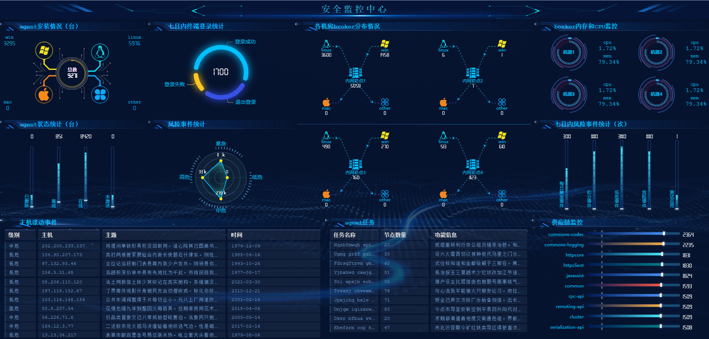

# 大屏模板

####! 本项目是一个使用npm中workspace来管理多个大屏项目的 `Monorepo` 项目。每个项目都在 `packages/` 下。

### 注意： node版本需要大于16，npm版本需要>=8.0

### 给所有项目安装依赖

```
npm install
```

### 给单独 `packages` 中的某个项目安装依赖

```
npm i axios -w ssoc
```

### 执行 `packages` 中的ssoc项目 `script` 脚本中的 `serve` 命令

> 当然也可以把命令写到最顶层的package.json中用常规的方式执行

```
npm run serve -w packages/ssoc
```

###截图
* [项目一](./example/nids)


* [项目二](./example/ssoc)



* [项目三](./example/ip)


